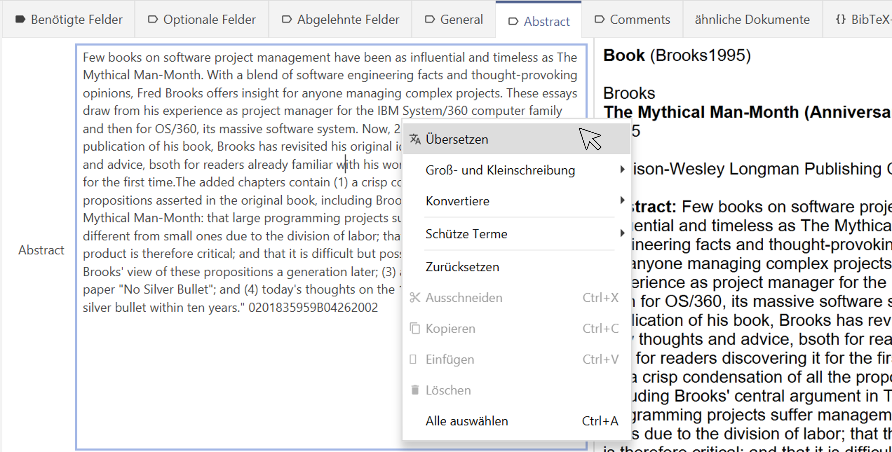
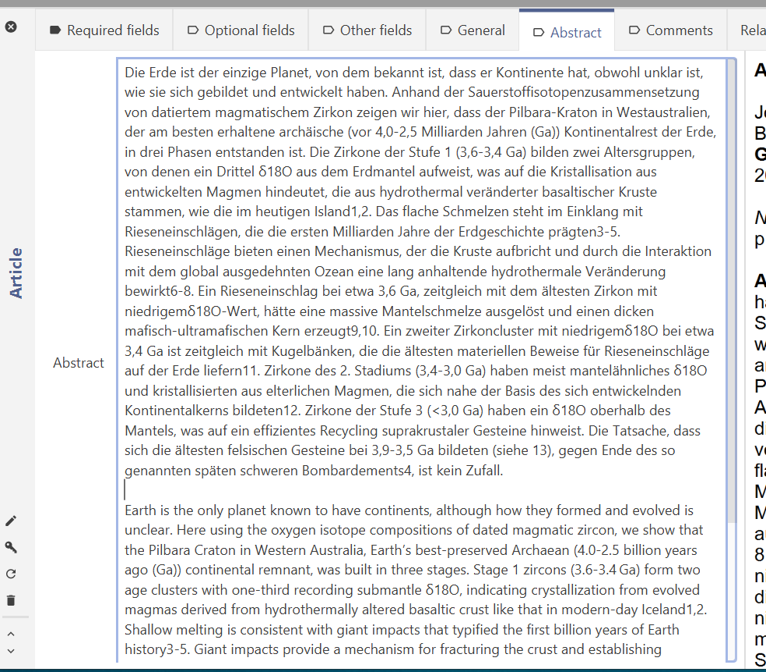
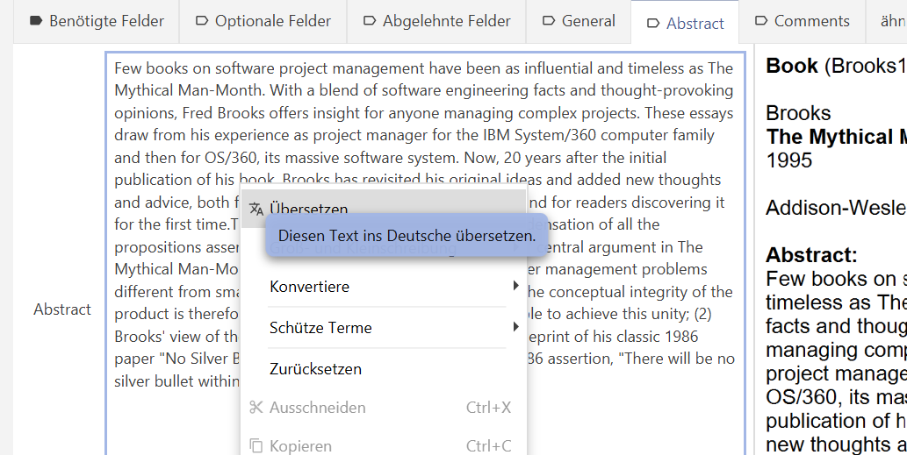
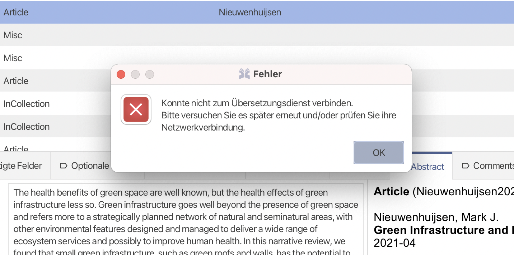
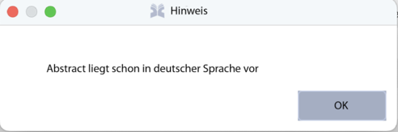
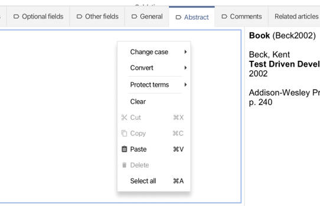

# Pflichtenheft JabRef-Erweiterung 
# Abstract Translator

Stand: 02.09.2022; Finale Version

## 1. Einleitung

### 1.1 Zweck

Die Nutzerinnen der Software JabRef sollen durch 
unsere Erweiterung bei jedem in nichtdeutscher und von Google-Translation 
übersetzbaren[^1] Sprache verfassten Eintrag der bibliographischen Daten die 
Möglichkeit erhalten, die Zusammenfassung (Abstract) in deutsche Sprache 
übersetzen zu lassen.[^2]

### 1.2 Einsatzbereich und Ziele

Es handelt sich um eine Erweiterung des freien Literaturverwaltungsprogrammes 
JabRef. Die Erweiterung übersetzt den Eintrag des Abstract-Feldes von einer nichtdeutschen Sprache ins Deutsche.

### 1.3 Definitionen

**Abstract**

Als Abstract wird die Zusammenfassung eines wissenschaftlichen Papers
oder einer anderen Literaturquelle verstanden. Der Abstract wird hierbei in JabRef
in einem speziellen Datenfeld `abstract` gespeichert. (siehe BibTex-Dokumentation)

**abstract Feld**

In diesem Feld des BibTex-Formats wird der Abstract gespeichert. (siehe BibTex-Dokumentation)

**GUI**

GUI ist das Akronym für Graphical User Interface und beschreibt die grafische Benutzeroberfläche von Computersystemen, um die Bedienung zu erleichtern.

**Kontextmenü**

Das Kontextmenü ist das Menü, welches erscheint, wenn über einem Element die rechte Maustaste gedrückt wird. Es erhält nur die auf dieses Element anwendbaren Befehle.

**Menüpunkt**

Als Menüpunkt wird die grafische Repräsentation eines Befehls im GUI betrachtet, der durch ein Menü aufgerufen wird. Hierbei kann es sich um ein Kontextmenü oder das Hauptmenü am oberen Fensterrand handeln.

**Nutzerin**

Als Nutzerin wird die Anwenderin des Programmes JabRef definiert. Zur besseren Lesbarkeit von Personenbezeichnungen und personenbezogenen Wörtern wird die weibliche Form genutzt. Diese Begriffe gelten für alle Geschlechter.

**Originaltext**

Als Originaltext wird jeder Text innerhalb eines JabRef-Eintrags verstanden, bevor die Erweiterung den Text übersetzt und verändert.

**Originalzustand**

Als Originalzustand wird der Ausgangszustand vor Anwendung der Erweiterung bezeichnet (Originaltext).

**Übersetzung**

Als Übersetzung wird die deutsche Übersetzung des Originaltextes des Abstracts bezeichnet.

### 1.4 Referenzierte Dokumente

[Dokumentation JabRef für Entwickler](https://devdocs.jabref.org/)

[Dokumentation BibTex-Format](http://mirrors.ctan.org/biblio/bibtex/base/btxdoc.pdf)

Dokumentation zur Verwendung von Google Translation API via Google Apps:

[https://developers.google.com/apps-script/guides/web](https://developers.google.com/apps-script/guides/web)

[https://developers.google.com/apps-script/reference/language](https://developers.google.com/apps-script/reference/language)

[https://developers.google.com/apps-script/reference/language/language-app](https://developers.google.com/apps-script/reference/language/language-app)

### 1.5 Überblick

Der Rest der vorliegenden Spezifikation enthält eine “Allgemeine Beschreibung” des Projekts mit Angaben zur “Einbettung”, “Funktionen”, “Benutzerprofile”, “Einschränkungen” sowie “Annahmen und Abhängigkeiten”.

Daran anschliessend werden dann die “Einzelanforderungen” des Projekts behandelt. Im Einzelnen werden hauptsächlich zwei Hauptanforderungen beschrieben, nämlich die Bereitstellung von einer deutschen Übersetzung eines vorliegenden Abstracts sowie die Einfügung dieser Übersetzung in den Abstract-Reiter vom JabRef. Es werden zusätzlich einige weitere Anforderungen beschrieben, die die Hauptanforderungen ergänzen.

## 2. Allgemeine Beschreibung

### 2.1 Einbettung

Die Erweiterung wird möglichst homogen in die vorhandene grafische Benutzeroberfläche von JabRef 
eingebettet. Wird ein Bibliothek-Eintrag ausgewählt, kann innerhalb des Reiters “Abstract” durch 
Rechtsklick im Abstract-Text ein Kontextmenü angezeigt werden. Durch die Erweiterung kann neu 
“Übersetzen” in diesem Kontextmenü ausgewählt werden (Abb. 1).

**Abb. 1.** Neu hinzugefügte “Übersetzen”-Funktion im Kontextmenü.

Nach dem Klick auf “Übersetzen” wird die Übersetzung oberhalb des Originaltextes eingefügt 
(siehe Abb. 2).

**Abb. 2.** Die Übersetzung wird vor dem Originaltext eingefügt.

Die Schnittstelle zum Übersetzungsdienst wird mittels der Googe-Apps-Script-Platform realisiert.[^3]

Andere Komponenten der Software werden im gleichen Funktionsumfang weiterhin nutzbar bleiben.

### 2.2 Funktionen

Das JabRef-Erweiterung Abstract Translator übersetzt einen vorhandenen nichtdeutschen Abstract (Originaltext) des BibText-Feldes Abstract eines Eintrages ins Deutsche und fügt den deutschen Abstract vor dem ursprünglichen Abstract ein.

### 2.3 Benutzerprofile

Die Übersetzungsfunktion ist für deutschsprachige Nutzerinnen gedacht. Die Nutzerin soll sich durch unsere Erweiterung einen schnelleren Überblick verschaffen können, welche thematischen Schwerpunkte im aufgeführten Eintrag in der Datenbank behandelt werden.

### 2.4 Einschränkungen

Nur Abstracts, die von Google Translator erkannt und übersetzt werden können, werden mit der JabRef-Erweiterung Abstract Translator  ins Deutsche übersetzt. Die Liste der unterstützten Sprachen ist auf der GoogleSeite[^4] festgehalten.

Der Zugriff auf die Translator API von Google wird von uns über die 
[Google-Apps-Script-Platform](https://script.google.com/) zur Verfügung gestellt.
Für Google-Apps-Scripte gelten (Tages-) Kontingente, die unter [dieser 
Dokumentation](https://developers.google.com/apps-script/guides/services/quotas) aufgeführt werden. "Translation calls" sind auf 5.000 Aufrufe pro Tag begrenzt[^5].

### 2.5 Annahmen und Abhängigkeiten

Es wird von folgenden Annahmen ausgegangen:

(1) Es werden keine Änderungen der Bedienungsoberfläche seitens der JabRef-Entwickler vorgenommen.

(2) Es ist möglich, ein übersetztes Abstract in den bestehenden Abstract-Reiter von JabRef einzufügen.

(3) Es ist möglich, ein Translation API von einem externen Dienst in die Erweiterung zu integrieren.

(4) Die Nutzerin hat in den JabRef-Einstellungen die Sprache "Deutsch" ausgewählt.

## 3. Einzelanforderungen

* /F10/ Durch Rechts-Klick innerhalb eines Abstract-Textes eines Bibliothek-Eintrages[^6] muss zuoberst im erscheinenden Kontextmenü der Befehl “Übersetzen” angezeigt werden (siehe Abb. 1 oben).
* /F11/ Wenn der Mauszeiger eine kurze Zeit über dem Kontextmenüpunkt „Übersetzen“ schwebt, soll ein Tooltip mit der Nachricht „Diesen Text ins Deutsche übersetzen.“ erscheinen (siehe Abb. 3).

**Abb.3.** Tooltip Anzeige

* /F20/ Durch klicken auf “Übersetzen” muss der deutsche Abstract an die Google Translation API übergeben werden.
* /F21/ Falls die Google Translation API nicht erreichbar ist, muss für die Nutzerin ein Hinweis (siehe Abb. 4) angezeigt werden.

**Abb. 4.** Anzeige, wenn Google Translation nicht erreichbar ist.

* /F30/ Es muss mittels einer zu definierenden Schnittstelle beim Anklicken auf “Übersetzen” überprüft werden, ob der Abstract in deutscher Übersetzung vorliegt.
* /F31/ Liegt der Abstract bereits in deutscher Sprache vor, muss ein Hinweis (siehe Abb. 5) für die Nutzerin angezeigt werden.

**Abb. 5.** Anzeige, wenn eine deutsche Übersetzung des Abstracts schon vorliegt.
* /F40/ Die Google Translation API muss eine deutsche Übersetzung des Abstracts liefern.
* /F50/ Die bereitgestellte Übersetzung muss in den Abstract-Reiter vor dem Originaltext eingefügt werden (siehe Abb. 2 oben).
* /F51/ In der JabRef Datenbank müssen sowohl die deutsche Übersetzung  als auch der originale Abstract gespeichert werden.
* /F60/ Liegt kein Abstract-Text vor, muss der Kontextmenüpunkt “Übersetzen” unterdrückt werden (siehe Abb. 6).

**Abb. 6.** Anzeige, wenn kein Abstract-Text vorliegt.

## 4. Abnahmekriterien

* /F10/ - /F60/ müssen erfüllt sein.

# Anhang

## Anhang A. Use-cases

### Use Case 1:

* Name: Übersetzung eines Abstracts ins Deutsche
* Akteur: deutschsprachige Nutzerin, die Literaturrecherche für eine schriftliche Arbeit betreibt.
* Vorbedingungen: deutschsprachige Nutzerin hat mindestens einen Datenbankeintrag 
in JabRef erfasst. Die Nutzerin hat in den JabRef- Einstellungen die Sprache "Deutsch" ausgewählt.
* Standardablauf
    * deutschsprachige Nutzerin wählt den Abstract-Reiter (siehe Abb. 1).
    * deutschsprachige Nutzerin lässt per Rechtsklick und anschliessend Auswahl “Übersetzen” im Kontextmenü das Abstract des Eintrages auf Deutsch übersetzen.
* Nachbedingungen Erfolg: Die deutsche Übersetzung wird vor dem Originaltext in den Reiter “Abstract” eingefügt (siehe Abb. 2).
* Nachbedingung Sonderfall: Es liegt kein Abstract (Sonderfall 1a) oder ein schon auf deutsch verfasstes Abstract (Sonderfall 1b) vor.

#### Sonderfall 1a: Kein Abstract vorhanden

* Ablauf Sonderfall 1a
    * Menüpunkt: “Übersetzen” erscheint nicht (siehe Abb. 6).

#### Sonderfall 1b: Abstract ist schon in deutsch verfasst.

* Ablauf Sonderfall 1b
    * Schritt 1: Die Nutzerin klickt auf den Menüpunkt: “Übersetzen”
    * Schritt 2: Die Nutzerin soll einen Hinweis erhalten, dass der Originaltext schon auf Deutsch vorliegt (siehe Abb. 5).

<!-- Footnotes themselves at the bottom. -->
## Notes

[^1]: Mögliche Übersetzungssprachen gemäss dieserListe: [https://cloud.google.com/translate/docs/languages](https://cloud.google.com/translate/docs/languages) (aufgerufen am 01.09.2022)

[^2]: Dabei spielt es keine Rolle, ob es sich dabei um einen neuen oder bestehenden Eintrag handelt.

[^3]: Wir verwenden dazu ein Google-Apps-Script-Skript ([https://script.google.com/](https://script.google.com/)), das auf die Google Translation API zugreift. Siehe:
https://github.com/sean-leichtle/jabref-hs2022/blob/main/src/main/java/org/jabref/logic/formatter/translator/TranslationAPIForJabRef.js (aufgerufen am 01.09.2022).

[^4]: Siehe: [https://cloud.google.com/translate/docs/languages](https://cloud.google.com/translate/docs/languages) (aufgerufen am 1.9.2022)

[^5]: Abgerufen am 20.10.2022 

[^6]: Es handelt sich hier, wie unter 1.1 Zweck erwähnt, sowohl um bestehende als auch um neu eingefügte Einträge.
