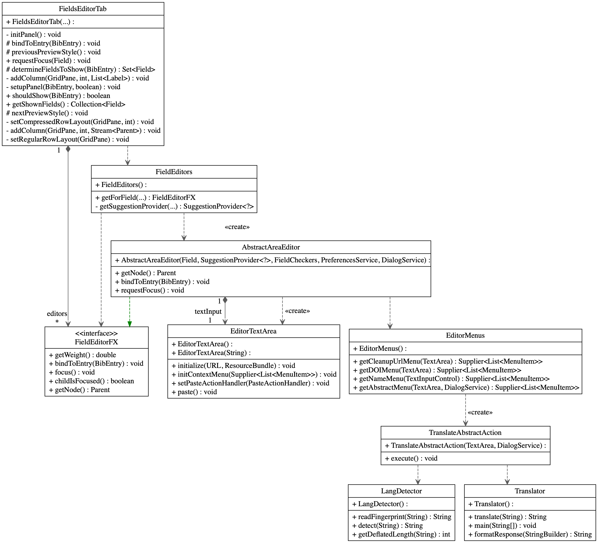
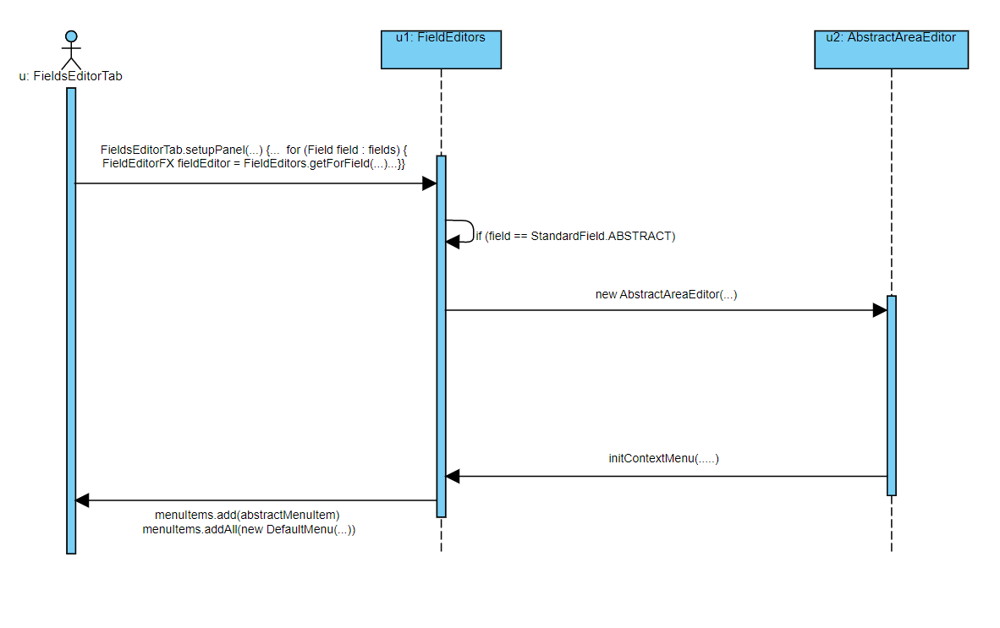

# Technische Dokumentation

<table>
  <tr>
   <td>
<h5><strong>Version</strong></h5>
</td>
   <td>
<h5><strong>Projektname</strong></h5>
</td>
   <td>
<h5><strong>Autor</strong></h5>
</td>
   <td>
<h5><strong>Status</strong></h5>
</td>
   <td>
<h5><strong>Datum</strong></h5>
</td>
   <td>
<h5><strong>Kommentar</strong></h5>
</td>
  </tr>
  <tr>
   <td>

0.2

   </td>
   <td>

Abstract Translator, eine Erweiterung für JabRef

   </td>
   <td>

Matthias Walther Büel, Sean Leichtle, Patrick Habegger, Marco Lichtsteiner

   </td>
   <td>

Finale Version

</td>
   <td>

15.09.2022

</td>
   <td>
   </td>
  </tr>
</table>

## 1 Einführung

### 1.1 Zweck

Der Zweck des vorliegenden Dokuments ist es, Aufschluss über die technischen Aspekte der JabRef-Erweiterung “Abstract Translator” zu geben. Dabei wird hauptsächlich auf Elemente wie Designziele, Systemverhalten und Design eingegangen. Besondere Aufmerksamkeit wird der Statik sowie der Dynamik der Erweiterung geschenkt.
Das Dokument selbst richtet sich an technisch interessierte Endbenutzer sowie an Personen, die sich mit der Wartbarkeit sowie der zukünftigen Erweiterung der JabRef-Software befassen möchten.

### 1.2 Beziehung zu anderen Dokumenten
Die vorliegende Dokumentation ergänzt das Pflichtenheft für das Projekt “Abstract Translator: eine Erweiterung für JabRef” (siehe https://github.com/sean-leichtle/jabref-hs2022/blob/main/docs/sweng/Pflichtenheft.md). Sie beschäftigt sich hauptsächlich mit modifizierten sowie mit neuen, ergänzenden Klassen im Kontext des JabRef-Systems, insbesondere mit den in 5.1, unten, erläuterten Klassen.

## 2. Systemübersicht

Beim Abstract Translator handelt es sich um eine Erweiterung für das open source Literaturverwaltungsprogramm JabRef (vgl. https://www.jabref.org). Das Ziel der Erweiterung ist es, das Abstract-Feld eines Aufsatzes von einer nichtdeutschen Sprache ins Deutsche zu übersetzen.

## 3. Designziele

In den folgenden Abschnitten werden wir die technische Lösung unserer Erweiterung detaillierter betrachten. Dabei unterscheiden wir zwischen statischen und dynamischen Aspekten des Designs.
## 4. Systemverhalten

Durch einen Rechtsklick innerhalb des Textfeldes vom Abstract-Reiter im JabRef erhält die Nutzerin die Möglichkeit, einen nicht auf Deutsch geschriebenen Abstract-Text durch weiteres Anklicken der Auswahl “Übersetzen”[^1] ins Deutsche übersetzen zu lassen. Falls ein deutscher Abstract-Text schon vorliegt, wird dies der Nutzerin gemeldet. Falls überhaupt kein Abstract-Text vorliegt, wird der Nutzerin keine Übersetzungsmöglichkeit angeboten.

## 5. Design

In den folgenden Abschnitten werden wir die technische Lösung unserer Erweiterung detaillierter betrachten. Dabei unterscheiden wir zwischen statischen, dynamischen sowie logischen Aspekten des Designs.

### 5.1 Statik

Das nachfolgende UML-Klassendiagramm (Abb. 1) visualisiert die für die Erweiterung genutzten Klassen und Interfaces, sowie deren Beziehungen zueinander. Dabei haben wir die `AbstractAreaEditor`-, `TranslateAbstractAction`-, `LangDetector`- sowie `Translator`-Klassen neu implementiert und die schon bestehenden `FieldEditors`- sowie `EditorMenus`-Klassen erweitert bzw. angepasst.

Abb. 1 UML-Klassendiagramm.

Im Allgemeinen können die hier dargestellten Beziehungen überwiegend als eine Art Dependency-Kette beschrieben werden.

- `FieldsEditorTab`

    Die `FieldsEditorTab`-Klasse (oben links) wird verwendet, um Tabs im Entry-Editor der JabRef-GUI einzurichten. Eine einzelne `FieldsEditorTab`-Instanz kann mehrere `FieldEditorFX`-Instanzen als Komponenten haben, was hier als Komposition-Verhältnis dargestellt wird. Um diese Aufgabe zu erledigen, verwendet `FieldsEditorTab` über die `setupPanel`-Methode die `FieldsEditor`-Klasse.

- `FieldEditors`

  Diese Klasse stellt u.a. eine Methode `getForField` zur Verfügung, die die Felder an einen bestimmten Kontextmenü-Editor bindet. Für unsere Erweiterung wird das Abstract-Feld an die Klasse `AbstractAreaEditor` gebunden. Als Rückgabewert dient `FieldEditorFX`.

- `FieldEditorFX`

    Dieses Interface stellt u.a. die Funktion `bindToEntry` zur Verfügung, die garantiert, dass jedes Bib-Feld an einen bestimmten Editor gebunden wird.

- `AbstractAreaEditor`

  Die `AbstractAreaEditor`-Klasse ist wiederum abhängig von der `EditorTextArea`-Klasse, die jedem `AbstractAreaEditor`-Konstruktor eine `EditorTextArea`-Instanz liefert.

  Diese Klasse implementiert das `FieldEditorFX`-Interface.

    Gleichzeitig verwendet der `AbstractAreaEditor`-Konstruktor die statische Methode `EditorMenus.getAbstractMenu` als Argument für die  `initContextMenu`-Methode der `EditorTextArea`-Klasse.

- `EditorTextArea`

  Diese Klasse stellt ein für die Nutzerin modifizierbares Textfeld zur Verfügung. Zudem wird in der Methode `initContextMenu` aus einem übergebenen `Supplier&lt;List&lt;Menuitem>>`-Argument (siehe die `EditorMenus`-Klasse unten) das eigentliche Kontextmenü erzeugt.

- `EditorMenus`
  
  Die `EditorMenus`-Klasse stellt vier (siehe UML) Getter-Methode für verschiedene `EditorMenus` zur Verfügung. 

  Die Methode `getAbstractMenu` liefert eine angepasste `MenuItem`-Liste zurück.

- `TranslateAbstractAction`

    Diese Klasse erbt indirekt von der `CommandBase`-Klasse, die die Methode `execute` zur Verfügung stellt, die es ermöglicht, unter Verwendung der `Translator`-Klasse eine Übersetzung anzufordern.

- `LangDetector`

    Die `TranslateAbstractAction`-Klasse verwendet die `LangDetector`-Klasse, deren `detect`-Methode die Sprache (Deutsch oder Englisch) eines vorliegenden Texts zurückgibt.  `getDeflatedLenght` und `readFingerprint` dienen dabei als Hilfsmethoden.

- `Translator`

    Als zweiter Supplier von der `TranslateAbstractAction`-Klasse dient die `Translator`-Klasse als Bindeglied zu einer externen Translation-API. Als Rückgabewert liefert die `translate`-Methode einen String zurück.

### 5.2 Dynamik

Das nachfolgende Sequenzdiagramm (Abb. 2) veranschaulicht einen Teilaspekt der Interaktionen, die  und JabRef im Kontext der hier dokumentierten Erweiterung. Es handelt sich um die Auswahlmöglichkeiten bei einem Rechtsklick auf das Abstract-Feld eines im JabRef erfassten Eintrags.

Abb. 2 UML-Sequenzdiagramm.

Der Vorgang wird mit einem Rechtsklick eingeleitet. In der Klasse `FieldEditorTab` 
wird mit dem Aufruf der Methode `setupPanel` jedem Feld ein Editor zugewiesen. 
In der Methode `getForField` wird getestet, ob die Userin einen Rechtsklick in das 
Abstract Feld getätigt hat (`if (field == StandardField.ABSTRACT)`). 
Falls dies zutrifft, wird der Konstruktor `AbstractAreaEditor` aufgerufen. 
Durch den Aufruf dieses Konstruktors wird mittels der Methode `initContextMenu` der 
Abstrakt-Menu-Editor um die Auswahlmöglichkeit “Übersetzen” ergänzt (`menuitems.add(...)`). Es erscheint der Nutzerin dann der Kontextmenü-Punkt “Übersetzen” zur Auswahl.

[^1]: Wir gehen davon aus, dass in den Einstellungen von JabRef die Sprache auf Deutsch gesetzt wurde. 
