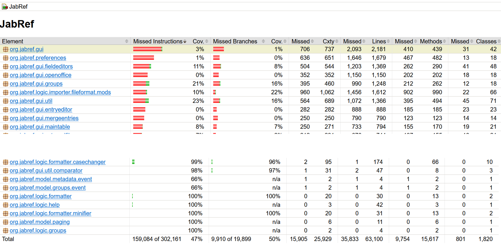
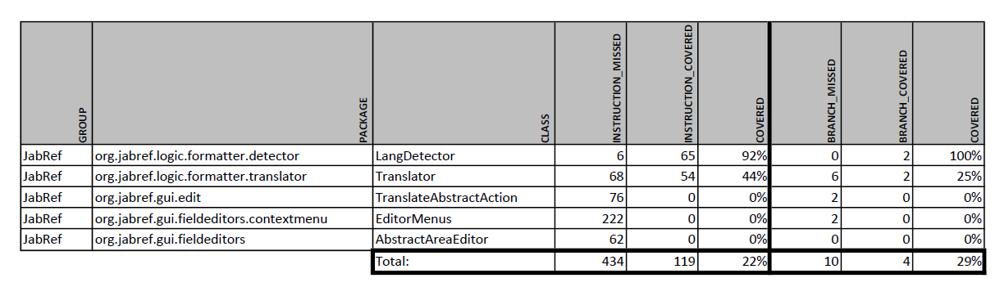
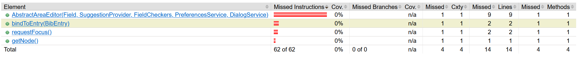
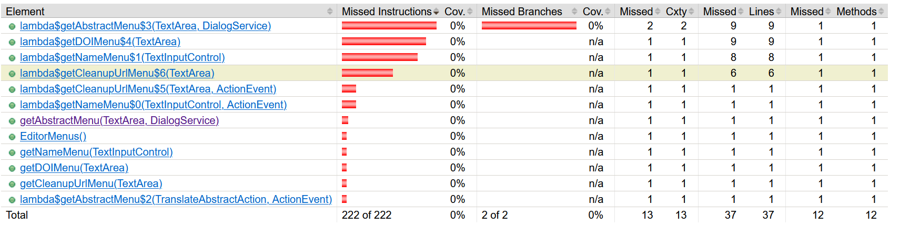
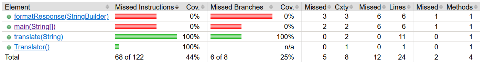
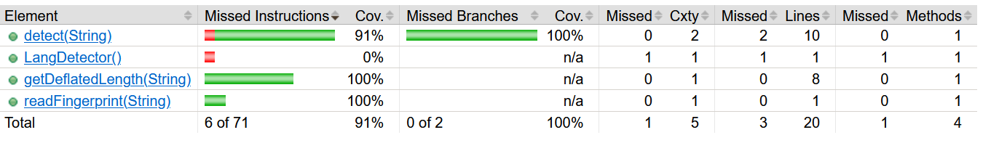

# Testcoverage

## 1.Testabdeckung insgesamt

Die Abbildung 1 bietet einen Auszug aus dem jacocoTestReport. Aufgrund der besseren Übersicht
sind nicht alle Klassen abgebildet. Der gesamte JacocoReport ist in [diesem Dokument](https://github.com/mwb28/jabref/blob/testplan/docs/sweng/jacocoTestReport.csv ) einsehbar.

**Abb. 1** Übersicht Testabdeckung

Von insgesamt 302161 ausführbaren CodeZeilen sind 159084 mit Tests aufgerufen worden.
Dies sind 47 % der gesamten Codemenge (ersichtlich in der Spalte "Missed Instruction" und anschliessend "Cov." [zweite Spalte von links]).

Von den Verzweigungen (Branches, typischerweise if/else und switch-Anweisungen) sind durch die Tests
50 % abgedeckt (ersichtlich in der Spalte "Missed Branches" und anschliessend "Cov.").

Die weiteren Spalten betreffen die zyklomatische Komplexität (Spalte "Cxty"), einzelne Zeilen ("Lines")
Methoden ("Methods") und Klassen ("Classes"), auf die wir nicht weiter eingehen werden.

## 2. Testabdeckung der Erweiterung Abstract Translator

Bei der Analyse beschränken wir uns auf die Klassen, die wir neu implementiert oder angepasst haben.
Die untenstehende Tabelle bietet einen Überblick über diese Testabdeckung.
Herauszulesen ist hierbei, dass von insgesamt 553 ausführbaren Codezeilen 22 % durch unsere Unittests
abgedeckt werden (119 Codezeilen). Es scheint offensichtlich, dass nicht alle dieser 553 Codezeilen von
uns geschrieben wurden.

**Abb. 2** Übersicht Testabdeckung der JabRef Translator Erweiterung

### 2.1. AbstractAreaEditor

**Abb. 3** Testabdeckung AbstractAreaEditor

Aufgrund von Abhängigkeiten mit dem Framework JavaFx und GUI- Komponenten sind hier
keine Unittests vorhanden.

### 2.2. EditorMenus

**Abb. 4** Testabdeckung EditorMenus

Auch hier wird aufgrund der GUI- Komponente auf Unittests verzichtet.

### 2.3. TranslateAbstractAction

**Abb. 5** Testabdeckung EditorMenus

Auch hier wird aufgrund der GUI-Komponente auf Unittests verzichtet.

### 2.4. Translator

**Abb. 6** Testabdeckung Translator

Wie bereits im Testplan erwähnt wird die Methode `translate` zu 100%
mit den Unittests abgedeckt.

### 2.5. LangDetector

**Abb. 7** Testabdeckung LangDetector

Die Codezeilen in der Klasse `LangDetector` werden zu 91% durch die Unittests abgedeckt.
