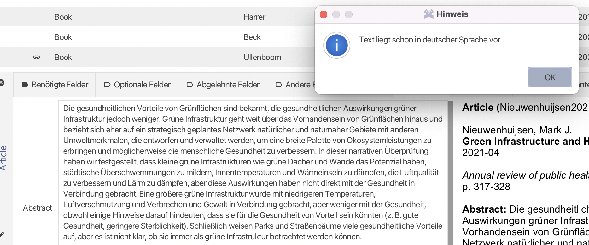

| Version | Projektname | Autoren                                                                   | Status         | Datum      | Kommentar |
|---------| --- |---------------------------------------------------------------------------|----------------|------------| --------- |
| 0.2     | Abstract Translator: eine Erweiterung für JabRef    | Sean Leichte, Matthias Walther-Büel, Patrick Habegger, Marco Lichtsteiner | Finale Version | 23.09.2022 | |
### 1\. Einführung 

Die Nutzerinnen der Software JabRef sollen durch unsere Erweiterung bei jedem in nichtdeutscher und von Google-Translator übersetzbaren Sprache verfassten Eintrag der bibliographischen Daten die Möglichkeit erhalten, die Zusammenfassung (Abstract) in deutsche Sprache übersetzen zu lassen. 

#### 1.1 Zweck 

Der Zweck des vorliegenden Dokuments ist es, Aufschluss über den Testplan der JabRef-Erweiterung “Abstract Translator: eine Erweiterung für JabRef” zu geben. Es listet alle identifizierten Aufgaben des Testens unserer Erweiterung auf, wie zu testende Merkmale, Vorgehensweise beim Testen und die jeweiligen Testfälle. Das Dokument selbst richtet sich hauptsächlich an interne Testteams.   

#### 1.2 Beziehung zu anderen Dokumenten 

Die vorliegende Dokumentation ergänzt das Pflichtenheft (siehe https://rb.gy/3ieeth)) sowie die Technische Dokumentation (siehe https://rb.gy/60fwsc) für das Projekt “Abstract Translator: eine Erweiterung für JabRef”. Aus den im Pflichtenheft dokumentierten Anforderungen werden die unten erläuterten Testfälle abgeleitet. 

#### 2\. Systemübersicht 

Beim Abstract Translator handelt es sich um eine Erweiterung für das open source Literaturverwaltungsprogramm JabRef (vgl. https://www.jabref.org). Das Ziel der Erweiterung ist es, das Abstract-Feld eines von JabRef erfassten Werks von einer nichtdeutschen Sprache ins Deutsche zu übersetzen. Getestet werden v.a. die Komponenten des GUI.   

### 3\. Merkmale 

#### 3.1 Zu testende Merkmale (Features / Funktionen) 

Es werden alle Grundfunktionalitäten der Erweiterung Abstract-Translator getestet. Die Tests umfassen das GUI sowie die Funktionen der Übersetzung und der Spracherkennung. 

Wir gehen davon aus (wie im Pflichtenheft bereits erwähnt), dass die Nutzerin in den JabRef-Einstellungen die Sprache «Deutsch» ausgewählt hat.  

##### 3.1.1 Funktionale Anforderungen 

Es werden folgende Funktionen gemäss Pflichtenheft getestet, wobei die Nummerierungsnamen jenen des Pflichtenhefts entsprechen: 

- /F10/ Durch Rechts-Klick innerhalb eines Abstract-Textes eines Bibliothek-Eintrages muss zuoberst im erscheinenden Kontextmenü der Befehl «Übersetzen» angezeigt werden. 

- /F11/ Wenn der Mauszeiger eine kurze Zeit über dem Kontextmenüpunkt «Übersetzen» schwebt, soll ein Tooltip mit der Nachricht „Diesen Text ins Deutsche übersetzen.“ erscheinen. 

- /F20/ Durch Klicken auf «Übersetzen» muss der deutsche Abstract an Google-Translation übergeben werden. 

- /F21/ Falls die Google Translation API nicht erreichbar ist, muss für die Nutzerin ein entsprechender Hinweis angezeigt werden. 

- /F30/ Es wird mittels eines lokalen Kompressionsalgorithmus beim Anlicken auf "Übersetzen" überprüft, ob ein Abstract in deutscher Übersetzung vorliegt. 

- /F31/ Liegt der Abstract bereits in deutscher Sprache vor, soll ein Hinweis für die Nutzerin angezeigt werden.

- /F40/ Google-Translation muss eine deutsche Übersetzung des Abstracts liefern. 

- /F50/ Die bereitgestellte Übersetzung muss in den Abstract-Reiter vor dem Originaltext eingefügt werden. 

- /F51/ In der JabRef-Datenbank müssen sowohl die deutsche Übersetzung des Abstracts als auch der originale Abstract gespeichert werden. 

- /F60/ Liegt kein Abstract-Text vor, muss der Kontextmenüpunkt «Übersetzen» nicht angezeigt werden 

#### 3.2 Nicht zu testende Merkmale (Features / Funktionen) 

Die Korrektheit der Übersetzung wird nicht getestet. Liegt eine Übersetzung vor, wird von deren Korrektheit ausgegangen. 

### 4 Vorgehensweise 

#### 4.1 Komponenten und Integrationstests 

Wir testen zwei Komponenten mittels automatischen Unit-Tests. Die restlichen Tests werden mit Funktionstests durchgeführt.

#### 4.2 Funktionstest 

Die funktionalen Anforderungen werden mittels Black-Box-Test getestet. Durch Eingabe im GUI werden die erwarteten Ausgaben visuell geprüft. 

### 5 Hardware und Softwareanforderungen 

JabRef muss installiert sein. Die Ausführung von Abstract-Translator benötigt eine funktionierende Internetverbindung.
### 6 Testfälle 

#### 6.1 Modultests 

Die Testfall-Namen entsprechen den Funktionen der funktionalen Anforderungen. 

| Name der Klasse       | Name des Testfalls | 
|-----------------------|--------------------| 
| LangDetectorTest.java | /TM30/             |
| TranslatorTest.java   | /TM40/             |

#### 6.2 Funktionstests 

Die Testfall-Nummern entsprechen den Funktionen der funktionalen Anforderungen. 

##### Testfall: /TF10/ 

- *Testziel:* Durch Rechts-Klick innerhalb eines Abstract-Textes eines Bibliothek-Eintrages wird zuoberst im erscheinenden Kontextmenü der Befehl «Übersetzen» angezeigt. 

- *Voraussetzung:* Der Bibliothek-Eintrag verfügt über einen Abstract-Text. 

- *Eingabe:* Rechts-Klick innerhalb eines Abstract-Textes eines Bibliothek-Eintrages 

- *Erwartete Ausgabe:* Der Menüpunkt «Übersetzen» erscheint im Kontextmenü. Siehe Abb. 1. 

- *Abhängigkeiten:* Abstract-Text muss vorhanden sein. 

 

**Abb. 1** Kontextmenüpunkt «Übersetzen» wird angezeigt. 

##### Testfall: /TF11/ 

- *Testziel:* Wenn der Mauszeiger eine kurze Zeit über dem Kontextmenüpunkt «Übersetzen» schwebt, soll ein Tooltip mit der Nachricht „Diesen Text ins Deutsche übersetzen.“ erscheinen. 

- *Voraussetzung:* Der Mauszeiger schwebt über dem Kontextmenüpunkt «Übersetzen». 

- *Eingabe:* Keine Eingabe 

- *Erwartete Ausgabe:* Der Tooltip “Diesen Text ins Deutsche übersetzen.” erscheint. 

- *Abhängigkeiten:* Der Kontextmenüpunkt «Übersetzen» erscheint.

**Abb. 2** Tooltip Anzeige. 

##### Testfall: /TF20/  

- *Testziel:* Durch Klick auf «Übersetzen» muss das deutsche Abstract an Google-Translation übergeben werden. 

- *Voraussetzung:* Google-Translation ist erreichbar. Das Abstract-Feld enthält Text. 

- *Eingabe:* Rechts-Klick innerhalb eines Abstract-Textes eines Bibliothek-Eintrages und anschliessender Klick auf «Übersetzen» im Kontextmenü 

- *Erwartete Ausgabe:* Im Abstract-Feld erscheint die deuschte Übersetzung des unsprünglichen Abstracts. Der ursprüngliche Abstract-Text erscheint getrennt unter der Übersetzung. Es erscheint keine Fehlermeldung. 

- *Abhängigkeiten:* keine 

##### **Testfall: /TF21/** 

- *Testziel:* Anzeige eines Hinweis-Fensters, wenn bei einem Aufruf der «Übersetzen»-Funktion der Google-Translator nicht erreichbar ist. 

- *Voraussetzung:* Google-Translation ist nicht erreichbar. 

- *Eingabe:* Rechts-Klick innerhalb eines Abstract-Textes eines Bibliothek-Eintrages und anschliessender Klick auf «Übersetzen» im Kontextmenü. 

- *Erwartete Ausgabe:* Es erscheint eine Fehlermeldung in einem Fenster. Siehe Abb. 3 

- *Abhängigkeiten:* keine 

**Abb. 3** Fehlermeldung, wenn Google Translator nicht erreichbar ist. 

##### **Testfall: /TF31/** 

- *Testziel:* Anzeige eines Hinweis-Fensters, wenn bei einem Aufruf der «Übersetzen»-Funktion ein Abstract in deutscher Sprache im Abstract-Feld schon vorliegt. 

- *Voraussetzung:* Ein Abstract liegt im Abstract-Feld bereits in deutscher Sprache vor

- *Eingabe:* Die Nutzerinruft die «Übersetzen»-Funktion im Kontextmenü durch Rechts-Klick innerhalb des Abstract-Feldes auf. 

- *Erwartete Ausgabe:* Ein Hinweis wird angezeigt, dass ein Abstract in deutscher Sprache schon vorliegt.  Siehe Abb. 4.  

- *Abhängigkeiten:* Abstract-Text in deutscher Sprache muss vorhanden sein.

**Abb. 4** Hinweis, wenn ein Abstract-Text in deutscher Sprache schon vorliegt.

##### **Testfall: /TF50/** 

- *Testziel:* Die Übersetzung wird in den Abstract-Reiter oberhalb des Originaltextes eingefügt. 

- *Voraussetzung:* keine 

- *Eingabe:* Die Nutzerin ruft die «Übersetzen»-Funktion im Kontextmenü durch Rechts-Klick innerhalb des Abstract-Feldes auf. 

- *Erwartete Ausgabe:* Der deutsche Text erscheint im Abstract-Feld, getrennt durch fünf Gleichheitszeichen, _vor_ dem Originaltext.  Siehe Abb. 5.  

- *Abhängigkeiten:* keine 

**Abb. 5** Deutsche Übersetzung oberhalb des Originaltextes.

##### **Testfall: /TF51/** 

- *Testziel:* In der JabRef Datenbank müssen sowohl die deutsche Übersetzung als auch das originale Abstract gespeichert werden. 

- *Voraussetzung:* Der Abstract-Translator muss per Rechts-Klick ausgeführt worden sein und ein Abstract gültig übersetzt haben. 

- *Eingabe:* Die aktuelle Bibliothek wird mit der Hauptmenüeingabe “Datei -> Bibliothek speichern” gesichert und danach geschlossen. 

- *Erwartete Ausgabe:* Beim erneuten Öffnen der entsprechenden JabRef-Bibliothek ist die deutsche Übersetzung vorhanden. 

- *Abhängigkeiten:* keine 

##### Testfall: /TF60/ 

- *Testziel:* Liegt kein Abstract-Text vor, muss der Kontextmenüpunkt «Übersetzen» nicht angezeigt werden. 

- *Voraussetzung:* Das Abstract-Feld ist leer. Es enthält keine Zeichen. 

- *Eingabe:* Rechts-Klick innerhalb eines Abstract-Textes eines leeren Bibliothek-Eintrages 

- *Erwartete Ausgabe:* Es wird kein Text im Abstract-Feld eingefügt. Der Kontextmenüpunkt 
«Übersetzen» wird nicht angezeigt. Siehe Abb. 6. 

- *Abhängigkeiten:* keine 

**Abb. 6** Kontextmenü ohne Kontextmenüpunkt "Übersetzen".
